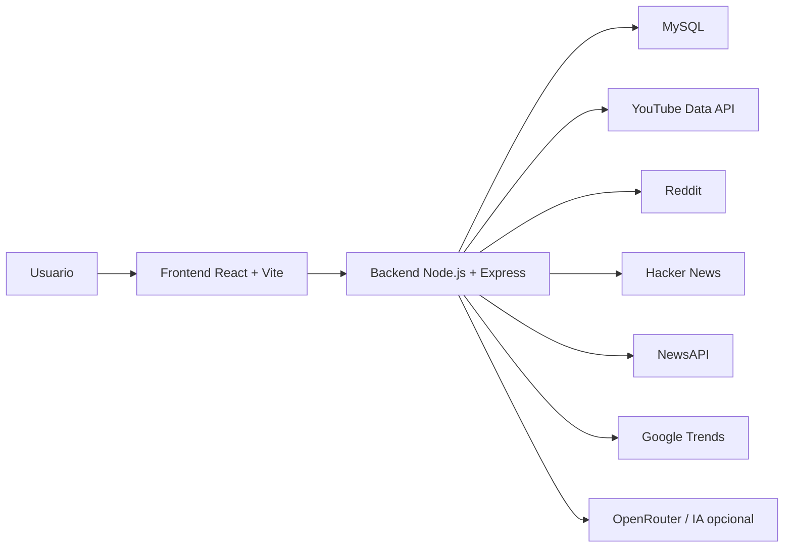
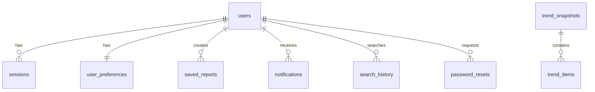

# Manual Tecnico General - Trend Flow

## 1. Introduccion

### 1.1 Descripcion general del proyecto

Trend Flow es una plataforma web de deteccion, monitoreo y analisis de tendencias en redes sociales y medios digitales. El sistema permite consultar temas en crecimiento, visualizar metricas de actividad, comparar capturas historicas, analizar fuentes de informacion y recibir alertas sobre posibles tendencias relevantes.

El proyecto esta orientado a funcionar como un prototipo academico funcional de apoyo a la toma de decisiones. Su objetivo no es afirmar predicciones absolutas, sino identificar senales tempranas a partir de datos recolectados, estimaciones y reglas heuristicas que permiten interpretar el comportamiento de temas digitales.

### 1.2 Problema que resuelve

En redes sociales y plataformas digitales, las tendencias cambian rapidamente. Para creadores de contenido, equipos de marketing, estudiantes, investigadores o analistas, puede ser dificil identificar que temas estan creciendo, de donde provienen y que oportunidades representan.

Trend Flow resuelve este problema centralizando informacion de distintas fuentes, normalizando datos, mostrando metricas visuales y generando una lectura ejecutiva sobre el estado de una tendencia.

### 1.3 Importancia del sistema

El sistema es importante porque permite:

- Detectar temas emergentes antes de que sean completamente masivos.
- Comparar fuentes como YouTube, Reddit, noticias, Hacker News y Google Trends.
- Consultar historiales y snapshots para observar evolucion temporal.
- Generar alertas y notificaciones sobre tendencias activas.
- Apoyar decisiones de contenido, investigacion o monitoreo digital.
- Presentar una solucion full-stack con frontend, backend, base de datos e integracion con APIs externas.

## 2. Objetivos

### 2.1 Objetivo general

Desarrollar una plataforma web llamada Trend Flow que permita monitorear, analizar y visualizar tendencias digitales mediante la integracion de fuentes externas, metricas derivadas, notificaciones, analitica visual y asistencia basada en IA.

### 2.2 Objetivos especificos

- Implementar un frontend interactivo para consultar dashboard, tendencias, analisis y configuracion del usuario.
- Desarrollar un backend modular con rutas separadas para tendencias, autenticacion, datos de usuario y asistente.
- Integrar fuentes externas como YouTube Data API, Reddit, Hacker News, NewsAPI y Google Trends.
- Guardar capturas historicas de tendencias en una base de datos MySQL.
- Implementar autenticacion de usuario, sesiones, preferencias y perfil.
- Generar notificaciones cuando existan tendencias relevantes.
- Incorporar una capa de analisis heuristico para sentimiento, riesgo, ciclo de vida, geografia y recomendaciones.
- Agregar un asistente de IA para apoyar la interpretacion de datos.
- Documentar el sistema con enfoque academico, tecnico y de usuario.

## 3. Alcance del Proyecto

### 3.1 Que incluye el sistema

Trend Flow incluye:

- Modulo de inicio de sesion y registro.
- Inicio con Google OAuth real.
- Inicio social de demostracion para otros proveedores.
- Dashboard general con metricas principales.
- Vista de tendencias con filtros y detalle de tendencia.
- Vista de analisis con graficas, mapas, rendimiento por plataforma, demografia y alertas.
- Configuracion de perfil, idioma, tema, privacidad y notificaciones.
- Temas visuales Night, Aurora y Daylight.
- Notificaciones sincronizadas con tendencias activas.
- Busqueda con historial y sugerencias.
- Asistente flotante de IA.
- Backend Express con rutas separadas por responsabilidad.
- Base de datos MySQL con tablas para usuarios, sesiones, reportes, notificaciones, snapshots e historiales.
- Archivo `.env.example` para configurar variables sin exponer claves reales.
- Repositorio GitHub para control de versiones.

### 3.2 Que no incluye el sistema

El sistema no incluye:

- Prediccion absoluta del futuro o garantia de viralidad.
- Escalamiento productivo con balanceadores, colas o microservicios.
- Aplicacion movil nativa.
- Panel administrativo avanzado.
- Sistema completo de roles y permisos por organizacion.
- Pago real de suscripciones.
- Envio real de correos para recuperacion de contrasena.
- Entrenamiento propio de modelos de inteligencia artificial.

### 3.3 Limitaciones

- Algunas APIs externas requieren claves activas y pueden tener limites de uso.
- La disponibilidad de datos depende de proveedores externos.
- Algunas metricas son derivadas, estimadas o heuristicas.
- La demografia puede ser estimada si no existe una fuente real disponible.
- La precision de sentimiento, riesgo y recomendaciones depende de reglas internas o proveedor IA.
- El sistema esta orientado a entrega academica y prototipo funcional, no a produccion empresarial.

## 4. Descripcion del Sistema

### 4.1 Tipo de sistema

Trend Flow es un sistema web full-stack compuesto por:

- Cliente web: aplicacion React con Vite y TypeScript.
- Servidor backend: API REST con Node.js y Express.
- Base de datos: MySQL.
- Integraciones externas: APIs de tendencias, noticias, videos y asistencia IA.

### 4.2 Usuarios del sistema

Usuarios principales:

- Estudiante o evaluador academico: revisa el funcionamiento y arquitectura del sistema.
- Analista de tendencias: consulta temas emergentes y comportamiento por fuente.
- Creador de contenido: identifica oportunidades para generar contenido.
- Equipo de marketing: observa crecimiento, riesgo y plataformas relevantes.
- Usuario general registrado: personaliza perfil, tema, notificaciones y preferencias.

### 4.3 Funcionalidades principales

- Registro e inicio de sesion.
- Sesion persistente mediante token.
- Inicio con Google OAuth.
- Consulta de tendencias virales.
- Dashboard con metricas generales.
- Analisis avanzado con graficas y mapas.
- Comparacion temporal mediante snapshots.
- Notificaciones de tendencias activas.
- Busqueda de tendencias.
- Historial de busqueda.
- Guardado de reportes.
- Configuracion de usuario.
- Temas visuales.
- Asistente de IA.

## 5. Requerimientos Funcionales

### RF-01 Registro de usuario

El sistema debe permitir crear una cuenta mediante nombre de usuario, correo electronico y contrasena.

### RF-02 Inicio de sesion

El sistema debe permitir al usuario autenticarse con correo y contrasena.

### RF-03 Inicio con Google

El sistema debe permitir iniciar sesion mediante una credencial valida de Google OAuth.

### RF-04 Gestion de sesion

El sistema debe mantener sesiones activas mediante tokens y validar su expiracion.

### RF-05 Consulta de tendencias

El sistema debe obtener tendencias desde fuentes externas y normalizarlas para mostrarlas en la interfaz.

### RF-06 Dashboard

El sistema debe mostrar metricas resumidas como menciones totales, crecimiento promedio, tendencia lider y actividad semanal.

### RF-07 Analisis avanzado

El sistema debe mostrar graficas de sentimiento, fase, fuentes, rendimiento por plataforma, demografia, mapa regional y alertas.

### RF-08 Notificaciones

El sistema debe generar y mostrar notificaciones relacionadas con tendencias activas.

### RF-09 Busqueda

El sistema debe permitir buscar tendencias por palabra clave y limpiar la barra de busqueda rapidamente.

### RF-10 Historial de busqueda

El sistema debe guardar y consultar busquedas realizadas por el usuario.

### RF-11 Reportes

El sistema debe permitir guardar reportes de dashboard, tendencias o analisis.

### RF-12 Configuracion de perfil

El sistema debe permitir modificar nombre, correo, biografia y avatar.

### RF-13 Preferencias

El sistema debe permitir modificar idioma, tema, notificaciones, privacidad y estado de cuenta.

### RF-14 Asistente IA

El sistema debe permitir enviar mensajes al asistente y recibir respuestas de apoyo sobre tendencias y uso del sistema.

### RF-15 Comparacion temporal

El sistema debe guardar snapshots y comparar tendencias actuales contra capturas previas.

## 6. Requerimientos No Funcionales

### 6.1 Rendimiento

- El sistema debe responder consultas principales en tiempos aceptables para una demostracion academica.
- Se utiliza cache en memoria para reducir llamadas repetidas a proveedores externos.
- Se limitan cargas pesadas como mensajes del asistente, avatar en base64 y campos de texto.
- La base de datos cuenta con indices para sesiones, notificaciones, historial, snapshots y busqueda.

### 6.2 Seguridad

- Las contrasenas se almacenan con hash usando bcrypt.
- Las sesiones usan tokens aleatorios.
- Las variables sensibles se guardan en `.env.local`, no en el repositorio.
- Existe `.env.example` para documentar configuracion sin exponer secretos.
- Se valida la credencial de Google contra el Client ID configurado.
- Se restringen tamanos de entrada para evitar cargas excesivas.

### 6.3 Usabilidad

- La interfaz cuenta con navegacion lateral clara.
- Existen tres temas visuales: Night, Aurora y Daylight.
- El sistema ofrece estados de carga, error y mensajes vacios.
- Las notificaciones muestran indicador visual de novedades.
- El buscador incluye sugerencias y boton para limpiar texto.
- El asistente se puede mover, minimizar y ocultar.

### 6.4 Disponibilidad

- El sistema depende de que el servidor backend y MySQL esten activos.
- Si una API externa falla, el sistema utiliza mecanismos de respaldo o informacion disponible.
- Para ejecucion local se requiere XAMPP/MySQL y Node.js.

### 6.5 Mantenibilidad

- El backend fue dividido en rutas, servicios y utilidades.
- La configuracion por entorno evita valores rigidos.
- Los tipos del frontend documentan contratos de respuesta.
- El codigo esta versionado en GitHub.

## 7. Arquitectura del Sistema

### 7.1 Diagrama general



### 7.2 Tecnologias utilizadas

Frontend:

- React
- Vite
- TypeScript
- Tailwind CSS
- Recharts
- Lucide React
- Radix UI

Backend:

- Node.js
- Express
- Axios
- MySQL2
- bcryptjs
- CORS
- Nodemon

Base de datos:

- MySQL
- XAMPP como entorno local

Control de versiones:

- Git
- GitHub

APIs externas:

- YouTube Data API v3
- Google Trends
- Reddit
- Hacker News
- NewsAPI
- OpenRouter para IA opcional

### 7.3 Estructura cliente-servidor

Trend Flow utiliza una arquitectura cliente-servidor:

- El cliente React consume endpoints REST del backend.
- El backend procesa solicitudes, consulta APIs externas, aplica normalizacion y accede a MySQL.
- La base de datos almacena usuarios, sesiones, preferencias, snapshots, reportes, notificaciones e historial.

### 7.4 Estructura del backend

```text
backend/
  server.js
  config.js
  db.js
  load-env.js
  cache.js
  auth-routes.js
  routes/
    assistant-routes.js
    trends-routes.js
    user-data-routes.js
  services/
    assistant-service.js
    data-origin.js
    trends-service.js
  utils/
    http.js
    validation.js
```

### 7.5 Estructura del frontend

```text
src/
  main.tsx
  app/
    App.tsx
    routes.ts
    pages/
      Dashboard.tsx
      Trends.tsx
      Analytics.tsx
      Settings.tsx
      Login.tsx
      NotFound.tsx
    components/
      Layout.tsx
      AssistantWidget.tsx
      AsyncStateCard.tsx
      RequireAuth.tsx
    context/
      AuthContext.tsx
      AppPreferences.tsx
    lib/
      api.ts
      copy.ts
  styles/
    index.css
    tailwind.css
    theme.css
```

## 8. Gestion del Proyecto

### 8.1 Metodologia

Para el desarrollo de Trend Flow se utilizo una metodologia incremental con practicas inspiradas en Scrum. El trabajo se dividio en bloques funcionales pequenos, permitiendo implementar, probar y mejorar cada modulo progresivamente.

Fases principales:

- Planeacion del sistema.
- Diseno de interfaz y experiencia de usuario.
- Implementacion del frontend.
- Implementacion del backend.
- Integracion de base de datos.
- Integracion de APIs externas.
- Refactor tecnico.
- Pruebas y ajustes visuales.
- Documentacion y publicacion en GitHub.

### 8.2 Cronograma tipo Gantt

| Actividad | Semana 1 | Semana 2 | Semana 3 | Semana 4 | Semana 5 |
|---|---|---|---|---|---|
| Analisis del problema | X |  |  |  |  |
| Diseno de interfaz | X | X |  |  |  |
| Frontend base |  | X | X |  |  |
| Backend y base de datos |  | X | X |  |  |
| Integracion de APIs |  |  | X | X |  |
| Autenticacion y sesiones |  |  | X |  |  |
| Analytics y reportes |  |  | X | X |  |
| Notificaciones y busqueda |  |  |  | X |  |
| Temas visuales |  |  |  | X | X |
| Pruebas y correcciones |  |  |  | X | X |
| Documentacion |  |  |  |  | X |
| Publicacion en GitHub |  |  |  |  | X |

### 8.3 Roles

| Rol | Responsabilidad |
|---|---|
| Desarrollador frontend | Construccion de interfaz, componentes y experiencia de usuario |
| Desarrollador backend | API, autenticacion, servicios y conexion con base de datos |
| Analista | Definicion de requerimientos, alcance y metricas |
| Tester | Validacion funcional, errores y pruebas de usuario |
| Documentador | Manual tecnico, manual de usuario y README |

En el contexto academico, estos roles pueden haber sido cubiertos por una sola persona, pero se documentan para representar una gestion formal del proyecto.

## 9. Metricas

### 9.1 Cumplimiento de tareas

| Area | Estado | Cumplimiento estimado |
|---|---|---|
| Login y registro | Completado | 100% |
| Google OAuth | Completado | 100% |
| Dashboard | Completado | 95% |
| Tendencias | Completado | 95% |
| Analytics | Completado | 95% |
| Configuracion | Completado | 95% |
| Notificaciones | Completado | 90% |
| Asistente IA | Completado | 90% |
| Base de datos | Completado | 95% |
| Documentacion | En elaboracion | 90% |

### 9.2 Tiempo estimado vs real

| Actividad | Tiempo estimado | Tiempo real aproximado | Observacion |
|---|---:|---:|---|
| Diseno visual | 8 h | 10 h | Se hicieron ajustes por temas visuales |
| Frontend principal | 18 h | 22 h | Varias vistas y estados UX |
| Backend | 16 h | 20 h | Refactor modular y validaciones |
| Base de datos | 8 h | 10 h | Tablas, indices y relaciones |
| Integracion APIs | 12 h | 16 h | Requiere llaves y manejo de fallos |
| Autenticacion | 8 h | 12 h | Incluye OAuth real |
| Pruebas y correcciones | 10 h | 14 h | Ajustes de tema claro y notificaciones |
| Documentacion | 6 h | 8 h | Manual y README |

### 9.3 Numero de incidencias

| Tipo de incidencia | Cantidad aproximada | Estado |
|---|---:|---|
| Visuales/contraste | 5 | Resueltas |
| Configuracion de APIs | 3 | Resueltas |
| Notificaciones | 2 | Resueltas |
| Autenticacion/OAuth | 2 | Resueltas |
| Refactor backend | 1 | Resuelta |
| Documentacion | 1 | En cierre |

## 10. Aseguramiento de Calidad

### 10.1 Estandares utilizados

Como referencia academica se consideran los siguientes estandares y modelos:

- ISO/IEC 25010: modelo de calidad de software, considerando usabilidad, seguridad, mantenibilidad y rendimiento.
- ISO/IEC/IEEE 29119: referencia para planeacion y documentacion de pruebas de software.
- MoProSoft: modelo de procesos para desarrollo y mantenimiento de software, util para documentar gestion, desarrollo y soporte.
- Buenas practicas de desarrollo web: separacion de responsabilidades, control de versiones, configuracion por entorno y validacion de entradas.

### 10.2 Estrategia de pruebas

La estrategia de pruebas se basa en validar los modulos principales del sistema desde tres niveles:

- Pruebas tecnicas del backend.
- Pruebas funcionales de interfaz.
- Pruebas de usuario final durante la demostracion.

### 10.3 Criterios de calidad

- El sistema debe iniciar sin errores en frontend y backend.
- El usuario debe poder iniciar sesion y navegar.
- Las vistas principales deben mostrar informacion o estados vacios claros.
- Las APIs externas no deben bloquear por completo la experiencia.
- Las claves privadas no deben aparecer en GitHub.
- Los temas visuales deben mantener legibilidad.
- El sistema debe tener documentacion suficiente para instalacion y defensa academica.

## 11. Tipos de Pruebas

### 11.1 Pruebas unitarias

Pruebas enfocadas en funciones individuales:

- Normalizacion de textos.
- Validacion de correo.
- Limites de longitud de campos.
- Calculo de score y crecimiento.
- Clasificacion de sentimiento o riesgo.

### 11.2 Pruebas de integracion

Pruebas entre modulos:

- Frontend consumiendo `/viral-trends`.
- Login consumiendo `/auth/login`.
- Google OAuth consumiendo `/auth/google`.
- Notificaciones consumiendo `/notifications`.
- Guardado de reportes consumiendo `/saved-reports`.
- Asistente consumiendo `/assistant/chat`.

### 11.3 Pruebas de sistema

Pruebas del flujo completo:

- Registro -> login -> dashboard.
- Login Google -> carga de usuario -> tendencias.
- Busqueda -> detalle de tendencia -> historial.
- Analytics -> filtros -> mapa -> detalle regional.
- Configuracion -> cambio de tema -> persistencia.
- Notificaciones -> punto rojo -> apertura -> lectura.

### 11.4 Pruebas de usuario

Pruebas desde la perspectiva del usuario:

- Comprension del dashboard.
- Facilidad para encontrar tendencias.
- Claridad del tema Daylight.
- Uso del asistente IA.
- Identificacion de notificaciones.
- Facilidad para cambiar perfil y preferencias.

### 11.5 Casos de prueba propuestos

| ID | Caso | Resultado esperado |
|---|---|---|
| CP-01 | Registrar usuario valido | Cuenta creada y sesion iniciada |
| CP-02 | Login con credenciales correctas | Acceso al dashboard |
| CP-03 | Login con datos incorrectos | Mensaje de error |
| CP-04 | Sesion expirada | Redireccion o error de sesion |
| CP-05 | Consultar tendencias | Lista de tendencias visible |
| CP-06 | Buscar tendencia | Resultados filtrados |
| CP-07 | Limpiar busqueda | Campo queda vacio |
| CP-08 | Abrir notificaciones | Punto rojo desaparece |
| CP-09 | Llegada de nueva notificacion | Punto rojo aparece |
| CP-10 | Cambiar tema a Daylight | Interfaz clara y legible |
| CP-11 | Guardar perfil | Datos persisten |
| CP-12 | Assistant sin proveedor externo | Respuesta de respaldo |

## 12. Gestion de Errores

### 12.1 Registro de bugs e incidencias

Se propone registrar incidencias con la siguiente estructura:

| Campo | Descripcion |
|---|---|
| ID | Identificador unico de incidencia |
| Fecha | Dia de deteccion |
| Modulo | Area afectada |
| Descripcion | Error observado |
| Prioridad | Alta, media o baja |
| Estado | Abierta, en proceso, resuelta |
| Solucion | Cambio aplicado |
| Responsable | Persona encargada |

### 12.2 Ejemplo de incidencias reales del proyecto

| ID | Modulo | Prioridad | Estado | Solucion aplicada |
|---|---|---|---|---|
| INC-01 | YouTube API | Alta | Resuelta | Configuracion de `YOUTUBE_API_KEY` y reinicio de servidor |
| INC-02 | Login Google | Alta | Resuelta | Configuracion de `VITE_GOOGLE_CLIENT_ID` y `GOOGLE_CLIENT_ID` |
| INC-03 | Login | Alta | Resuelta | Correccion de error `Cannot access isRegister before initialization` |
| INC-04 | Notificaciones | Media | Resuelta | Sincronizacion sin necesidad de abrir panel |
| INC-05 | Tema claro | Media | Resuelta | Ajuste de contraste y fondos especificos |
| INC-06 | Mapa Daylight | Media | Resuelta | Fondo claro difuminado y colores adaptados |

### 12.3 Prioridades

- Alta: impide iniciar sesion, consultar datos o usar una vista principal.
- Media: afecta experiencia visual, flujo secundario o comprension.
- Baja: detalle estetico o mejora no critica.

## 13. Manual de Usuario

### 13.1 Acceso al sistema

1. Abrir la aplicacion en el navegador.
2. Iniciar sesion con correo y contrasena, o usar Google si esta configurado.
3. Si no existe cuenta, seleccionar registro y crear usuario.

### 13.2 Pantalla de Login

Permite:

- Iniciar sesion.
- Registrarse.
- Usar Google OAuth.
- Acceder mediante opciones sociales de demostracion.
- Recuperar contrasena mediante flujo simulado.

### 13.3 Panel principal

El Dashboard muestra:

- Menciones totales.
- Tendencia lider.
- Crecimiento promedio.
- Interacciones estimadas.
- Tendencia destacada.
- Actividad semanal.

Uso:

1. Entrar a Panel.
2. Revisar tarjetas superiores.
3. Observar tendencia destacada y graficas.

### 13.4 Tendencias

La vista Tendencias permite:

- Ver lista de tendencias.
- Filtrar mediante busqueda.
- Revisar fuente, crecimiento, menciones y estado.
- Abrir detalle de tendencia.
- Consultar recomendaciones, tags y enfoque geografico.

### 13.5 Analisis

La vista Analisis permite:

- Consultar graficas de sentimiento y ciclo de vida.
- Revisar rendimiento por plataforma.
- Consultar mapa de Mexico con pulso regional.
- Ver monitor de crisis.
- Revisar demografia estimada o real.
- Exportar o guardar reportes.

### 13.6 Notificaciones

Uso:

1. Cuando llegue una nueva notificacion, aparece un punto rojo sobre el icono de campana.
2. Al abrir el panel, el punto rojo desaparece porque se considera visto.
3. Si llega una nueva notificacion posteriormente, el punto vuelve a aparecer.
4. El usuario puede abrir una notificacion para buscar la tendencia relacionada.

### 13.7 Busqueda

Uso:

1. Dar clic en el icono de lupa.
2. Escribir una palabra clave.
3. Presionar Enter o seleccionar una sugerencia.
4. Usar la "X" para limpiar el campo de busqueda.

### 13.8 Configuracion

Permite:

- Cambiar nombre, correo, biografia y avatar.
- Seleccionar idioma.
- Cambiar tema visual: Night, Aurora o Daylight.
- Configurar notificaciones.
- Configurar privacidad.
- Pausar o restaurar cuenta.

### 13.9 Asistente IA

El asistente flotante permite:

- Hacer preguntas sobre el sistema.
- Pedir resumen de tendencias.
- Solicitar ideas de contenido.
- Interpretar graficas.
- Minimizarse, ocultarse o moverse en pantalla.

## 14. Manual Tecnico

### 14.1 Requisitos de instalacion

Software requerido:

- Node.js
- npm
- XAMPP o servidor MySQL equivalente
- Git
- Navegador moderno

### 14.2 Instalacion

1. Clonar el repositorio:

```bash
git clone https://github.com/CAAC12381/Trend-Flow.git
```

2. Entrar a la carpeta:

```bash
cd Trend-Flow
```

3. Instalar dependencias:

```bash
npm install
```

4. Crear archivo `.env.local` basado en `.env.example`.

5. Configurar variables de entorno.

6. Iniciar MySQL en XAMPP.

7. Levantar backend:

```bash
npm run dev:api
```

8. Levantar frontend:

```bash
npm run dev
```

### 14.3 Configuracion de entorno

Variables principales:

| Variable | Descripcion |
|---|---|
| `PORT` | Puerto del backend |
| `CORS_ORIGIN` | Origen permitido del frontend |
| `API_BASE_URL` | URL base del backend |
| `VITE_API_BASE_URL` | URL del backend usada por el frontend |
| `DB_HOST` | Host de MySQL |
| `DB_PORT` | Puerto de MySQL |
| `DB_USER` | Usuario de base de datos |
| `DB_PASSWORD` | Contrasena de base de datos |
| `DB_NAME` | Nombre de base de datos |
| `YOUTUBE_API_KEY` | Clave para YouTube Data API |
| `GOOGLE_CLIENT_ID` | Client ID backend para Google OAuth |
| `VITE_GOOGLE_CLIENT_ID` | Client ID frontend para Google OAuth |
| `OPENROUTER_API_KEY` | Clave opcional para IA |
| `OPENROUTER_MODEL` | Modelo de IA |
| `NEWS_API_KEY` | Clave opcional para noticias |

### 14.4 Comandos disponibles

| Comando | Funcion |
|---|---|
| `npm run dev` | Inicia frontend Vite |
| `npm run dev:api` | Inicia backend con nodemon |
| `npm run start:api` | Inicia backend con Node |
| `npm run build` | Genera build de produccion del frontend |

### 14.5 Base de datos

El archivo `backend/db.js` crea la base de datos y tablas si no existen.

Tablas principales:

- `users`: informacion de usuario.
- `sessions`: tokens y expiracion.
- `user_preferences`: preferencias, notificaciones y privacidad.
- `trend_snapshots`: capturas historicas.
- `trend_items`: tendencias por snapshot.
- `trend_enrichments`: analisis enriquecido.
- `saved_reports`: reportes guardados.
- `notifications`: notificaciones de usuario.
- `search_history`: historial de busqueda.
- `audience_demographics`: datos demograficos.
- `password_resets`: recuperacion de contrasena.

### 14.6 Relaciones principales



### 14.7 Endpoints principales

| Metodo | Endpoint | Descripcion |
|---|---|---|
| GET | `/health` | Verifica estado del backend |
| GET | `/viral-trends` | Consulta tendencias |
| GET | `/dashboard-summary` | Obtiene resumen del dashboard |
| GET | `/analytics-summary` | Obtiene analisis general |
| GET | `/historical-trends?q=` | Consulta historial de tendencia |
| POST | `/assistant/chat` | Envia mensajes al asistente |
| POST | `/auth/register` | Registro de usuario |
| POST | `/auth/login` | Inicio de sesion |
| POST | `/auth/google` | Inicio con Google |
| GET | `/auth/me` | Consulta usuario autenticado |
| PATCH | `/auth/profile` | Actualiza perfil |
| PATCH | `/auth/preferences` | Actualiza preferencias |
| GET | `/notifications` | Lista notificaciones |
| POST | `/notifications/sync` | Sincroniza notificaciones |
| PATCH | `/notifications/:id/read` | Marca una notificacion como leida |
| PATCH | `/notifications/read-all` | Marca todas como leidas |
| POST | `/search-history` | Guarda busqueda |
| GET | `/search-history` | Consulta historial |
| POST | `/saved-reports` | Guarda reporte |
| GET | `/saved-reports` | Consulta reportes |

### 14.8 Seguridad tecnica

- No subir `.env.local` a GitHub.
- Usar `.env.example` como referencia publica.
- Rotar claves si fueron expuestas accidentalmente.
- Mantener OAuth restringido por origen autorizado.
- Validar entrada en endpoints sensibles.
- Mantener dependencias actualizadas.
- Usar HTTPS en despliegues reales.

### 14.9 Control de versiones

Repositorio:

```text
https://github.com/CAAC12381/Trend-Flow
```

Flujo recomendado:

```bash
git status
git add .
git commit -m "Descripcion breve del cambio"
git push
```

Con GitHub Desktop:

1. Revisar cambios en la pestana Changes.
2. Escribir Summary.
3. Presionar Commit to main.
4. Presionar Push origin.

## 15. Conclusiones

### 15.1 Resultados obtenidos

Trend Flow logro consolidarse como una plataforma web funcional para monitoreo de tendencias. El sistema integra frontend, backend, base de datos, autenticacion, analisis visual, notificaciones, temas personalizables e integracion con APIs externas.

El proyecto demuestra conocimientos de desarrollo full-stack, arquitectura cliente-servidor, consumo de APIs, persistencia de datos, manejo de sesiones, diseno de interfaces y documentacion tecnica.

### 15.2 Aprendizajes

Durante el desarrollo se reforzaron aprendizajes en:

- React y Vite para construccion de interfaces.
- TypeScript para mejorar claridad de datos.
- Express para diseno de APIs REST.
- MySQL para persistencia y relaciones.
- OAuth para autenticacion externa.
- Git y GitHub para control de versiones.
- Buenas practicas de seguridad con variables de entorno.
- Importancia de distinguir datos reales, estimados y heuristicas.

### 15.3 Retos

Los principales retos fueron:

- Integrar APIs externas con diferentes formatos de datos.
- Manejar claves y configuraciones de forma segura.
- Mantener legibilidad en multiples temas visuales.
- Sincronizar correctamente notificaciones.
- Separar backend monolitico en modulos reutilizables.
- Explicar academicamente los limites de metricas estimadas.

### 15.4 Cierre

Trend Flow es un prototipo academico completo y defendible. Aunque no pretende ser una solucion predictiva absoluta, si ofrece un sistema solido para detectar senales tempranas, analizar tendencias y apoyar decisiones mediante informacion visual, historica y contextual.

